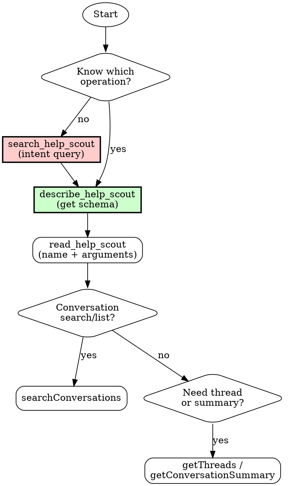

# HelpScout Navigation

Guide for correctly using the Help Scout MCP gateway. Prevents common mistakes and ensures complete search results.

## First Step: Diagnose Setup

Follow these steps IN ORDER. Do not skip ahead.

---

### Step 1: Check if MCP Tools are Available

Look for these three tools in your available tools:
- `mcp__helpscout__search_help_scout`
- `mcp__helpscout__describe_help_scout`
- `mcp__helpscout__read_help_scout`

**If tools ARE available:** ✅ Skip to "Critical Rules" section. You're ready to go.

**If tools are NOT available:** Continue to Step 2.

---

### Step 2: Check if Credentials are Set

Run this command:
```bash
echo "HELPSCOUT_APP_ID: ${HELPSCOUT_APP_ID:+[SET]}" && echo "HELPSCOUT_APP_SECRET: ${HELPSCOUT_APP_SECRET:+[SET]}"
```

**If both show `[SET]`:** Credentials exist but MCP didn't start. Go to Step 4.

**If either is blank:** Credentials are missing. Go to Step 3.

---

### Step 3: Set Up Credentials

Tell the user:

> **HelpScout credentials are not configured.**
>
> **Get your credentials:**
> 1. Go to HelpScout → Your Profile → My Apps
> 2. Create a new app (or use existing)
> 3. Copy the **App ID** and **App Secret**
>
> **Add to your shell profile** (`~/.zshrc` or `~/.bashrc`):
> ```bash
> export HELPSCOUT_APP_ID="your-app-id-here"
> export HELPSCOUT_APP_SECRET="your-app-secret-here"
> ```
>
> **Then go to Step 4.**

---

### Step 4: Restart Correctly (IMPORTANT)

⚠️ **This is where most people get stuck.**

The MCP server inherits environment variables from Claude Code's process. If Claude Code was started before the credentials were set, it won't have them.

Tell the user:

> **You must restart BOTH your terminal AND Claude Code:**
>
> 1. **Quit Claude Code completely** (not just close the window)
> 2. **Close your terminal completely** (not just the tab)
> 3. **Open a new terminal** (this loads your updated `.zshrc`)
> 4. **Start Claude Code from this new terminal**
>
> ```bash
> claude
> ```
>
> The Help Scout MCP server will now start with the correct credentials.

**Do not proceed with HelpScout operations until the MCP tools are available.**

---

## Overview

The Help Scout MCP server advertises exactly three tools. Behind them sits a registry of 55 read-only operations covering conversations, customers, organizations, reports, metadata, and Docs:

| Tool | Purpose |
|------|---------|
| `search_help_scout` | Find operations by intent. Returns up to 8 name + description summaries. |
| `describe_help_scout` | Get full input schemas for up to 10 named operations. |
| `read_help_scout` | Execute one operation: `{"name": "<operation>", "arguments": {...}}` |

**The flow is always:** search for operations → describe the one(s) you picked → execute with `read_help_scout`.

**Core problems this skill solves:**
1. Users guess argument shapes instead of calling `describe_help_scout` first
2. Users look up inbox IDs when they are already in the server instructions
3. Users don't know which operation fits their query type
4. Users reach for conversation search when a customer, org, report, metadata, or Docs operation fits better

---

## Critical Rules (MUST READ FIRST)

### Rule 1: Route Through the Gateway

1. `search_help_scout(query: "<user's intent>")` to find candidate operations
2. `describe_help_scout(names: ["<operation>"])` to get the exact input schema
3. `read_help_scout(name: "<operation>", arguments: {...})` to execute

Operation names in the registry also dispatch directly as legacy compatibility, but always route through the gateway: `search_help_scout` surfaces the right operation and `describe_help_scout` gives you the real schema instead of a guess.

### Rule 2: Inbox IDs Come From Server Instructions

Inboxes are auto-discovered at connect time and listed in the server instructions with their IDs. **No lookup call is needed.** Use the numeric ID from there. Only call `listAllInboxes` (optionally with `nameContains`) if you need to re-check mid-session.

### Rule 3: searchConversations is THE Conversation Search

`searchConversations` is the only conversation search and list operation. It searches **active + pending + closed by default** (spam excluded), so keyword searches do not silently miss closed tickets. Convenience filters: `contentTerms`, `subjectTerms`, `email`, `emailDomain`, `customerIds`, `hasAttachments`, `inboxId`, `folderId`, `tag`, `status`, `createdAfter`/`createdBefore`, `conversationNumber`, `assignedTo`.

### Migration Note (older guidance)

If you have seen older docs for this server, these operations are gone:

| Removed | Use instead |
|---------|-------------|
| `searchInboxes` | `listAllInboxes` (optionally `nameContains`), or just the server instructions |
| `comprehensiveConversationSearch`, `advancedConversationSearch`, `structuredConversationFilter` | `searchConversations` with convenience filters |
| `listCustomersV3` | `listCustomers` with `useV3` / `cursor` |
| `getCustomerAddress` and other customer contact sub-resources | `getCustomerContacts` |

---

## Decision Tree: Which Operation to Use



### Quick Decision Matrix

All operations below run through `read_help_scout`. Call `describe_help_scout` first when unsure of arguments.

| I want to... | Operation | Notes |
|--------------|-----------|-------|
| Search or list conversations (keywords, email, domain, tag, status, dates, ticket #) | `searchConversations` | The only conversation search; all statuses by default |
| Read full conversation | `getThreads` | Need conversation ID |
| Get raw conversation object | `getConversation` | Need conversation ID |
| Get quick overview | `getConversationSummary` | Need conversation ID |
| Get current server time | `getServerTime` | Use for date-relative queries |
| List inboxes | `listAllInboxes` | Usually unnecessary; IDs in server instructions |
| Inbox custom fields, folders, routing | `getInbox` | `include: ["fields","folders","routing"]` |
| Look up customer by email | `searchCustomersByEmail` | Exact match |
| Browse customers | `listCustomers` | `useV3`/`cursor` for the v3 path |
| Full customer profile | `getCustomer` | Need customer ID |
| Customer contact channels (emails, phones, address, ...) | `getCustomerContacts` | Need customer ID |
| Browse organizations | `listOrganizations` | Sortable by activity, size, name |
| Organization details / members / history | `getOrganization`, `getOrganizationMembers`, `getOrganizationConversations` | Need organization ID |
| Tags, users, teams | `listTags`, `listUsers`, `getUser`, `listTeams`, `getTeamMembers` | |
| Saved replies | `listSavedReplies`, `getSavedReply` | |
| Attachments and raw email source | `getAttachment`, `downloadAttachmentFile`, `getOriginalSource` | |
| Workflows, webhooks, ratings | `listWorkflows`, `listWebhooks`, `getWebhook`, `getSatisfactionRating` | |
| Reports | `getCompanyReport`, `getConversationsReport`, `getProductivityReport`, `getUserReport`, `getHappinessReport`, `getChannelReport`, `getDocsReport` | Plan-gated |
| Docs knowledge base | `listDocsSites`, `searchDocsArticles`, `getDocsArticle`, and 12 more Docs operations | Use `search_help_scout("docs ...")` |

See [references/tool-reference.md](references/tool-reference.md) for complete parameter documentation.

---

## Common Workflows

### Workflow 1: Search Inbox X for Keyword Y

**User:** "Search the support inbox for billing issues"

**Steps:**
1. Get the Support inbox ID from the server instructions (no lookup call needed).
2. Confirm the schema, then execute:
   ```
   describe_help_scout(names: ["searchConversations"])
   read_help_scout(
     name: "searchConversations",
     arguments: { contentTerms: ["billing"], inboxId: "359402" }
   )
   ```
   Searches active + pending + closed by default.

### Workflow 2: Show Recent Tickets in Inbox X

**User:** "Show me recent tickets in the sales inbox"

```
read_help_scout(
  name: "searchConversations",
  arguments: { inboxId: "359402", sort: "createdAt", order: "desc", limit: 20 }
)
```

### Workflow 3: Find Ticket #12345

```
read_help_scout(name: "searchConversations", arguments: { conversationNumber: 12345 })
read_help_scout(name: "getConversationSummary", arguments: { conversationId: "<id from step 1>" })
```

### Workflow 4: Find All Tickets from Domain

**User:** "Find tickets from @acme.com"

```
read_help_scout(name: "searchConversations", arguments: { emailDomain: "acme.com" })
```

### Workflow 5: Recent Tickets in a Date Window

**User:** "Show me tickets from the last 30 days"

```
read_help_scout(name: "getServerTime", arguments: {})
read_help_scout(
  name: "searchConversations",
  arguments: { createdAfter: "<serverTime minus 30 days, ISO8601>", sort: "createdAt", order: "desc", limit: 50 }
)
```

### Workflow 6: Get Full Conversation Thread

```
read_help_scout(name: "getThreads", arguments: { conversationId: "12345678", limit: 200 })
```

### Workflow 7: Customer Investigation by Email

**User:** "Look up jane@acme.com and show their history"

```
read_help_scout(name: "searchCustomersByEmail", arguments: { email: "jane@acme.com" })
read_help_scout(name: "getCustomer", arguments: { customerId: "12345" })
read_help_scout(name: "searchConversations", arguments: { customerIds: [12345], sort: "createdAt", order: "desc" })
```

### Workflow 8: Organization Account Review

**User:** "Show me everything about the Acme Corp account"

```
read_help_scout(name: "listOrganizations", arguments: { sortField: "name" })
read_help_scout(name: "getOrganization", arguments: { organizationId: "456", includeCounts: true })
read_help_scout(name: "getOrganizationMembers", arguments: { organizationId: "456" })
read_help_scout(name: "getOrganizationConversations", arguments: { organizationId: "456" })
```

---

## Anti-Patterns (What NOT to Do)

| Mistake | Why It Fails | Correct Approach |
|---------|--------------|------------------|
| Calling `mcp__helpscout__searchConversations` as an MCP tool | Only three tools are advertised | `read_help_scout(name: "searchConversations", ...)` |
| Guessing arguments for `read_help_scout` | Schemas vary per operation | `describe_help_scout` first |
| Calling `listAllInboxes` before every search | Inbox IDs are already in server instructions | Read the server instructions |
| Passing an inbox name as `inboxId` | IDs are numeric strings, not names | Use the ID from server instructions |
| Adding `status: "active"` to keyword searches "to be safe" | Default already covers active + pending + closed | Omit `status` unless narrowing on purpose |
| Hardcoding "today" in date filters | Server clock may differ | `getServerTime` first |
| Asking any operation to create or modify data | Every operation is read-only | Do it in the Help Scout UI |

See [references/common-mistakes.md](references/common-mistakes.md) for more anti-patterns.

---

## Quick Reference Card

```bash
# STEP 1: Find operations by intent
search_help_scout(query: "find tickets about billing")

# STEP 2: Get exact schemas (up to 10 names)
describe_help_scout(names: ["searchConversations", "getThreads"])

# STEP 3: Execute (all searches default to active+pending+closed)
read_help_scout(name: "searchConversations", arguments: {
  contentTerms: ["billing", "refund"],
  inboxId: "359402"           # from server instructions
})

# Direct ticket lookup
read_help_scout(name: "searchConversations", arguments: { conversationNumber: 12345 })

# Email domain search
read_help_scout(name: "searchConversations", arguments: { emailDomain: "acme.com" })

# Full thread / quick summary
read_help_scout(name: "getThreads", arguments: { conversationId: "12345678" })
read_help_scout(name: "getConversationSummary", arguments: { conversationId: "12345678" })

# Customer lookup
read_help_scout(name: "searchCustomersByEmail", arguments: { email: "jane@acme.com" })
read_help_scout(name: "getCustomer", arguments: { customerId: "12345" })
read_help_scout(name: "getCustomerContacts", arguments: { customerId: "12345" })

# Organization traversal
read_help_scout(name: "listOrganizations", arguments: { sortField: "conversationCount", sortOrder: "desc" })
read_help_scout(name: "getOrganization", arguments: { organizationId: "456", includeCounts: true })
read_help_scout(name: "getOrganizationMembers", arguments: { organizationId: "456" })
read_help_scout(name: "getOrganizationConversations", arguments: { organizationId: "456" })
```

---

## Common Mistakes Checklist

Before executing a HelpScout operation, verify:

- [ ] Unsure which operation? → Called `search_help_scout` with the user's intent?
- [ ] Know the operation? → Called `describe_help_scout` before building arguments?
- [ ] Executing? → Using `read_help_scout(name, arguments)`, not the operation name as a tool?
- [ ] Inbox mentioned? → Using the numeric ID from server instructions (no lookup call)?
- [ ] Conversation search? → Using `searchConversations` (all statuses by default)?
- [ ] Date-relative query ("last week", "today")? → Called `getServerTime` first?
- [ ] Looking up a customer? → `searchCustomersByEmail`, not conversation search?
- [ ] Investigating an account? → `listOrganizations` → `getOrganization` → `getOrganizationMembers`?
